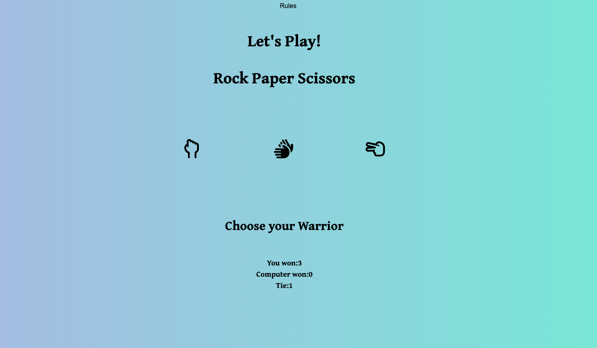

# Rock Paper Scissors 

Rock paper scissors (also known by other orderings of the three items, with "rock" sometimes being called "stone," is a hand game, usually played between two players, in which each player simultaneously forms one of three shapes with an outstretched hand. These shapes are "rock" (a closed fist), "paper" (a flat hand), and "scissors" (a fist with the index finger and middle finger extended, forming a V).

  
  * View [The Game](https://srz97.github.io/Rock-paper-scissors-Game/) web page here.
  
 #  User Experience
 
 I want the user to:

* Play and enjoy a simple and entertaining game.
* Be able to choose an option in order to win a round.
* See the rules mentioned super easy to understand.
* See live score and get anxious to play another round.

  # Colour Scheme
  
  I have chosen a mixture of dark and light colours which includes combination of perivinkel and turquoise for the background with the help of  [Grabient Colors](https://cssgradient.io/gradient-backgrounds/).The instruction page has a silver background while the buttons turn yellow on hover.The mixture of modern color scheme combination allows user to have a delightfull experiance.
  
  
  
  
# Design & Typography

I wanted the game to look a bit like an modern game, and inspires by it's simplicity. To achieve that I chose a font of Gentium Book Plus that looked very peaceful and styled the game window like smoth and easy going with a mirthfull game desiged by the font  chosen with the hep of [Font Awesome](https://fontawesome.com/).

  
# General Features

For the layout of the page, I chose to create a game window with two buttons on the left top corner which makes it clear for the user if they want to have a look at rules on how to play? or just reset the game after playing it once. Upon click on the Rules button,I chose to have the rules accessible in a modal Box  which is displayed on top of the current page. Which further explains the  "Rock, paper, scissors" game in order to avoid any confusion about the result I chose to display their symbols along with their meanings which is aimed to clarify the user and to have full confidence over the game.

  
  
 # Rules
  
* Rock beats scissors and loses to paper. chose the symbol which closed fist to throw a rock out. This powerful play is strong enough to break the fragile scissors, but can’t fight its way past the paper, which wraps itself around the rock to suffocate it
* Scissors beat paper but loses to rock. Play scissors by making sure to pick the sign with your index and middle finger. The sharp scissors carve through paper with ease, but they’re too weak to stand up to a rock slamming into them.
* Paper beats rock, but loses to scissors. Chose the icon which lay fingers flat and keep them together to play paper. The slick and flexible paper wraps around the rock to lock it down, but it can’t fight back against the sharp scissors.
  

# Game window  

* Upon hover over the upon the Icon it pops up which then  easily allows the user the select thier warrior.
* Simultaneously upon the click, computer aswell chooses an random Warrior.
* The results are displayed right beneath the Icons.

# Result

* The reults are displayed immediately after the choice slected by the user and are recoreded on the number of times the game is played.
* The live results are shown on the bottom of the page which keep the user motvated to play and keep acknowledged about the game.
* If the user wins so its mentioned and recorded same is the case with computer.
* Upon a draw it's calculates as a Tie. 

# Languages Used

* HTML
* CSS
* Javascript

# Testing 
 
 # Validator testing
 
 * The CSS was validated 

* The HTML was tested in the w3c validator. No problems were found.
* 

* This was the lighthouse result:
* 

* Javascript validator

[Jshint](https://jshint.com/) was used the test has shown the following data;

CONFIGURE
Metrics
There are 7 functions in this file.

Function with the largest signature take 1 arguments, while the median is 0.

Largest function has 24 statements in it, while the median is 2.

The most complex function has a cyclomatic complexity value of 5 while the median is 1.

# Bugs

 ### Accessibility Improvement
 
While testing in Lighthouse, I discovered that the accessibility was a bit low, which was fixed by providing each button with a specific Name.

### Favicon Not Displaying

I encounterd the issues with the website's favicon not displaying correctly, I followed these steps to troubleshoot and resolve the problem:

**Checked File Path** Verified that the `href` attribute and `<link>` tag for the favicon points to the correct file path relative to your website's root directory. For example:

 
`<link rel="icon" type="image/x-icon" href="/assets/images/favicon.ico">`

## Deployment

* This game was deployed to github pages.

* Open the repository settings.
* Go to "pages" (found under "code and automation").
* Choose which branch to build from. You want to choose "main". Do not forget to save the settings.
* Open the repository in github desktop (I used github desktop. You can do this in git too.)
* Choose to create a local clone.
* Copy the link to your deployed website (which can be found in the github pages settings, where you chose which branch to build from) and make sure it is   operating as expected.
* The deployed website will now be updated when you push anything new to the repository.

 # Forking and cloning
* Forking is creating a new repository with the same content as the one you forked.
* This is done by going to the repository you want to clone, and clicking the "fork" icon in the top right corner.
* Cloning is used for making local copies of your code.
* Cloning a repository with github desktop is easily done by clicking the green "code" button and choosing the "open in github desktop" option. If you do not have a clone already, github desktop will ask if you want to create a local clone. Click yes.
*If you do it with git you have to write "git clone" and then specify what you want to clone.

# Credits

* Code assistence and jQuery were used from [W3 Schools](https://www.w3schools.com/java/) & [Stack overflow](https://stackoverflow.com/questions/5132323/aligning-a-div-to-center-of-page-while-its-position-is-absolute) 
* [Gradient](https://cssgradient.io/gradient-backgrounds/) was used to create the background.
* Icons were created by [Font Awesome](https://fontawesome.com/) & [Google Font](https://fonts.google.com/)
* [Favi Icons](https://www.favicon.cc/) was created using this web page.
* Information and details were gather from [Wikipedia](https://sv.wikipedia.org/wiki/Portal:Huvudsida)
* [Colors](https://coolors.co/acb6e5-74ebd5-aaaaaa-151516-ffe66d) were created with the help of this web page.
* [Amirresponsive](https://ui.dev/amiresponsive)
